# 📦 Automated Chute-Pulling Flow (Power Automate + Excel Script) *Cart.com*
## 🔗 Overview

This Power Automate–based solution automatically retrieves chute assignments from scheduled email attachments every 2 hours and transforms them into a neatly formatted matrix table that’s instantly sent to pack leaders.

It eliminates manual work — no more downloading attachments, opening files, filtering for the right CHUTEs, or preparing distribution lists. The system automatically pulls, filters, classifies, and emails the chute list within seconds.

## ⚙️ How It Works
### 1️⃣ Email Trigger

Every 2 hours, the flow scans incoming messages for the designated automated inventory email containing the chute list Excel attachment.

### 2️⃣ Data Extraction

The attachment is:

- Saved to a connected SharePoint/OneDrive folder.

- Read through an Office Script that extracts the latest data table from the workbook.

### 3️⃣ Data Filtering

A Power Automate step calls an Excel Script that:

- Filters only Rush or Standard orders (depending on parameters).

- Ensures Carton Status = "00 - Printed".

- Ensures Req Ship Date = Today.

- Normalizes and deduplicates CHUTE values (removes “Y” suffix, trims spaces).

### 4️⃣ Line Grouping (Second Script)

The filtered chute list is passed into a second script that classifies CHUTEs into Line 1–8, based on numeric ranges for each chute zone (A/B):

| Zone          | Range | Line       |
| ------------- | ----- | ---------- |
| **A001–A152** | →     | **Line 1** |
| **A153–A300** | →     | **Line 2** |
| **A301–A448** | →     | **Line 3** |
| **A449–A600** | →     | **Line 4** |
| **B001–B148** | →     | **Line 7** |
| **B149–B306** | →     | **Line 8** |
| **B307–B450** | →     | **Line 6** |
| **B451–B600** | →     | **Line 5** |

The script builds a matrix layout where:

- Each column is a line (Line 1–8).

- Each cell below contains the corresponding CHUTEs stacked vertically.

### 5️⃣ HTML Formatting & Email Output

Power Automate then:

- Creates an HTML table from the matrix data.

- Injects inline CSS for neat borders and spacing.

- Sends the styled chute matrix via email to all designated pack leaders.

- Result: Within seconds, the team receives a visual chute summary table — fully automated, human-error free.

## 🧠 Key Technologies

| Component | Purpose |
|------------|----------|
| **Power Automate (Flow)** | Orchestrates the entire process — from email trigger, file parsing, and Excel Script execution to the final email dispatch. |
| **Excel Office Scripts (TypeScript)** | Cleans, filters, and transforms the raw chute data into structured JSON tables, ready for further processing. |
| **HTML/CSS (Inline Styling)** | Formats the final matrix with gridlines for clear visual separation, ensuring neat email presentation. |
| **Outlook Connector** | Sends the formatted chute matrix directly to designated pack leaders and distribution groups. |

## 🚀 Impact

✅ Fully hands-free chute distribution — no manual file handling.

✅ Data consistency — filters use strict date and status logic.

✅ Improved speed — processing done automatically every 2 hours.

✅ Immediate visibility — pack leaders know exactly which lines to deploy resources to.

✅ Reduced errors — no missed chutes, no duplicate assignments.

## 🧩 Automation Flow Diagram

```mermaid
flowchart TD
    A[Incoming Email Attachment] --> B[Save Attachment to SharePoint]
    B --> C[Run Excel Script #1: Filter & Deduplicate CHUTEs]
    C --> D[Run Excel Script #2: Group by Line 1–8 Matrix]
    D --> E[Create HTML Table + Add CSS Styling]
    E --> F[Send Styled Email to Pack Leaders]

```

## 📸 Example Output (Email)
| Line 1 | Line 2 | Line 3 | Line 4 | Line 5 | Line 6 | Line 7 | Line 8 |
|---------|---------|---------|---------|---------|---------|---------|---------|
| A001 | A153 | A301 | A449 | B451 | B307 | B001 | B149 |
| A002 | A154 | A302 | A450 | B452 | B308 | B002 | B150 |
| ...  | ...   | ...   | ...   | ...   | ...   | ...   | ...   |

Styled with subtle borders and padding for clarity.

## 💡 Example Use Case

At large distribution facilities, multiple packing lines are assigned specific chute ranges.
Previously, leads had to:

1. Download the raw Excel report from email.

2. Filter CHUTEs by rush status, ship date, and carton status.

3. Manually split them by line and re-send to each leader.

This automation performs all of that *instantly.*

## 📁 Repository Contents
File	Description

`/scripts/getTableData.ts` - Initial Excel Script that retrieves table data.

`/scripts/filterTableData.ts` - Second Excel Script that filters and dedupes Chute Lists.

`/scripts/getChutesFromLines.ts` - Final Excel Script that groups CHUTEs by Line 1–8 and returns matrix layout.

`/docs/FlowDiagram.png`	- (Optional) Visual workflow chart.

`/README.md` - Project documentation (this file).

### Extra

JSON Schema (parsing the returned string from the script)

`{
    "type": "array",
    "items": {
        "type": "object"
    }
}`

## 🧑‍💼 Author

Abraham Efraim
Automation Developer / Logistics Process Optimization – Cart.com
📍 Groveport, Ohio

“This project showcases how process automation can bridge logistics and technology — removing repetitive manual work and enabling real-time visibility for operational teams.”
